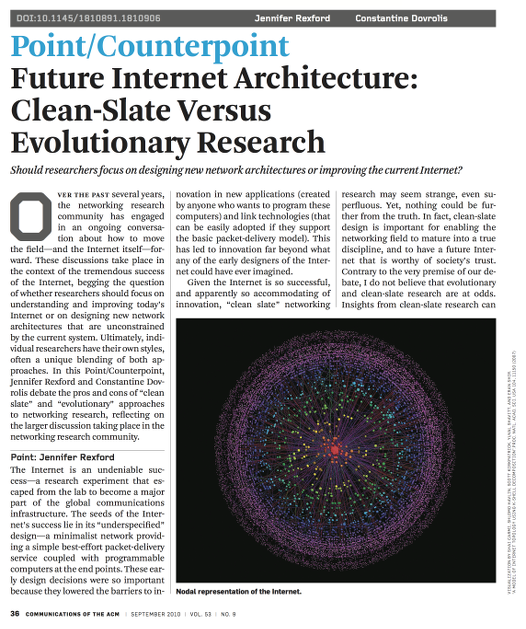
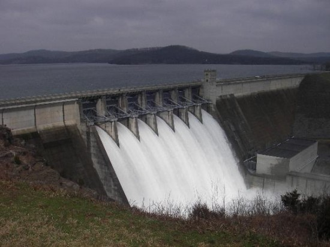
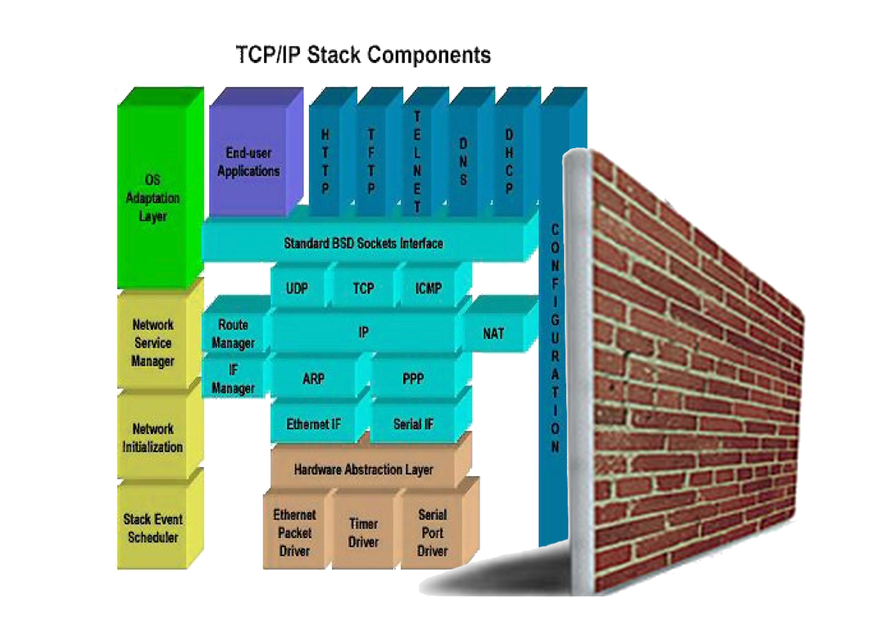
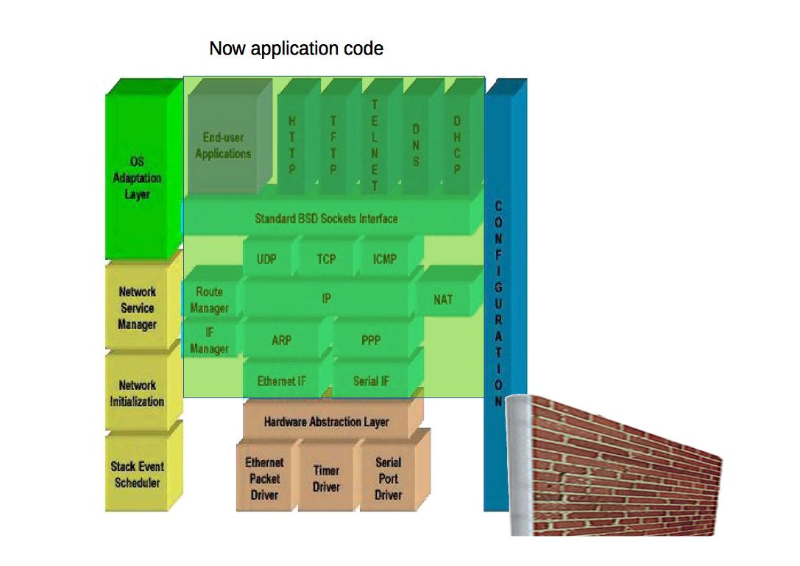
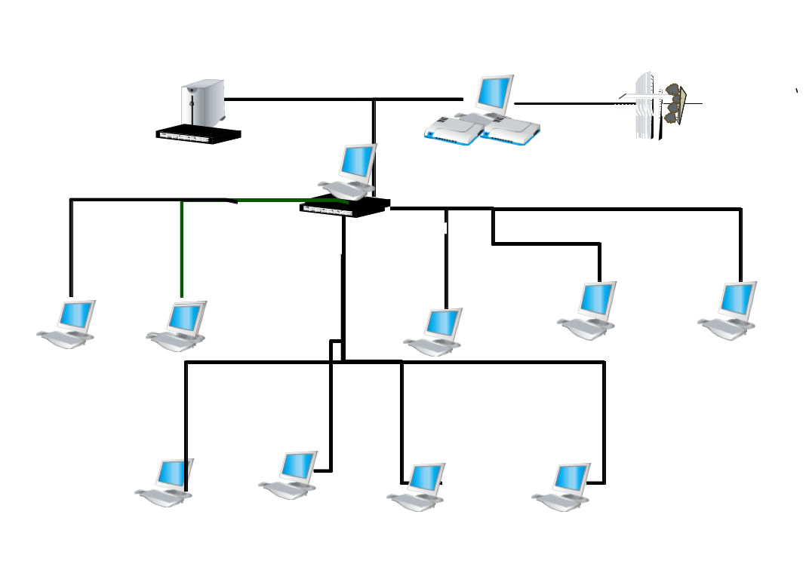
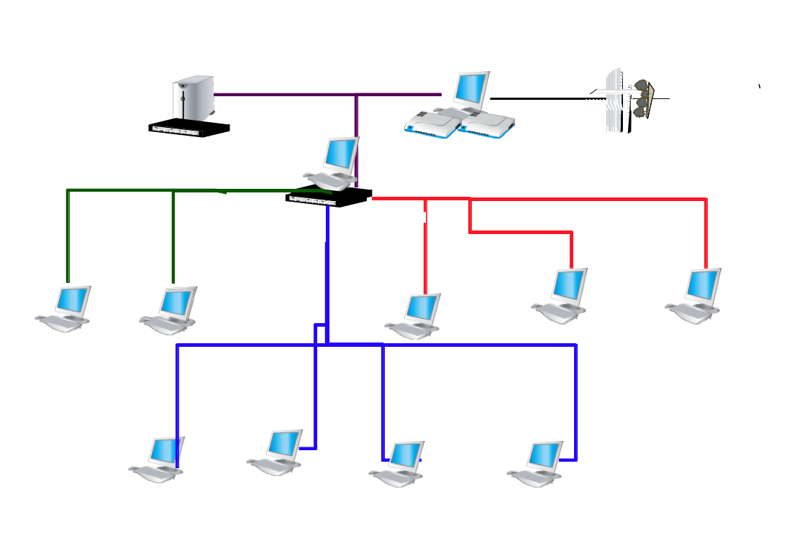
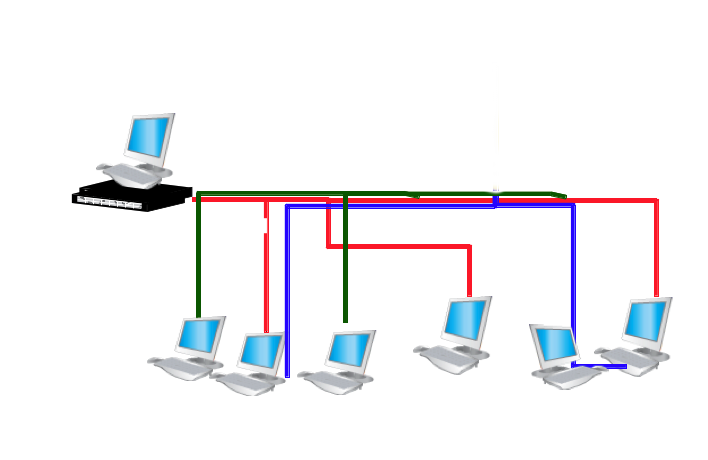

class: center, middle
# The Road to
# Software  Networks
---
class: left, top
background-image: url(images/stuck.png)

.large.white[##**Internet non-programmable**
]
---
class: center, top, inverse
name: Challenges
#**Programmability**

.left[

#What makes the Internet so rigid?
<!-- ##**Clean Slate vs. Evolution Battle** -->
]

---
class: center, top, inverse
name: Evil Protocols
.white[
#**Protocols are evil**
##(When they're not needed)
]

.center[]
 # Stifle Development
---
name: Clean Slate vs.
.right-column[]
.left-column[
## Clean Slate
###One winner?
###Run parallel?
###Programmable?
###[The Mad Rush](sites/CCR Papers from July 2014 | acm sigcomm.html)
]
---

name: Ignore the Internet
class: left, top
#Clean Slate or Evolution?
##Don't fix the Internet and don't compete with it
##Take the Orthogonal view
.large.red.center[# **Ignore it!**
]
---

name: View from the outside
class: center, middle, inverse
#View the Internet from the **Outside**

.left[
##Today's approaches see the Internet from the inside
##PC revolution encompassed computing from the outside
]
---

class: top, left
name: Cooperative effort
.left-column[##Cooperative effort
#**Opens the floodgates**
]
.right-column.right[##between Government, academia, Industry

.center[##**Much** less costly than the alternatives
]
]
---

class: top, left
name: Roadmap
- ##Merge switching functionality into devices
- ##Multiplex regimes over the same infrastructure
- ##Kickstart popularization and availibility with DSLs
---

class: top, left
name: Run any regime
.center[#**"_Running_" a regime**
]
##Same as running a program on a computer
##Load the same code onto all the devices "running" the regime
##No problem if the code is in lodable, user space memory
---

class: left, top
name: Protocol Wall
#**Protocol Wall**
###The height above which freely programmable application code can be written
###Above the Protocol Wall, protocols are no longer protocols
###We use the term, _networking regime_
---

class: center, middle
name: High Protocol Wall
##**High Protocol Wall**

.center[]
---

class: center, middle
name: Low Protocol Wall
##**Low Protocol Wall**

.center[]
---

class: center, middle
name: Protocol Wall
#**Protocol Wall Height**
.center[]
---

class: left, top
name: Merging1
##Merge switching and computing functionality
##As many switches/computers as you like. It's all software

---

class: center, middle
name: Run them all together
# All Regimes Flow in Parallel

---

class: left, top
name: Merging2
#Run different regimes
##By replacing software networking "stacks"

---

class: left, top
name: Merging3
##Multiplex over same infrastructure
##By exposing multiple MAC addresses on same port

---

class: left, middle, large
name: Performance
#Performance Disscussion
---

class: left, middle
name: Software mindset
#Software mindset is different
##No need to anticipate problems and propose solutions
#just code
---

class: left, top
name: Pot of Gold
.center[#Pot of Gold
]
.right-column[]
##Inter-regime transfer
##Pool unheard of processing resources
##Distributed applications

