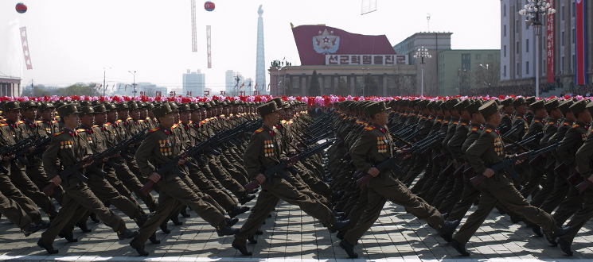

class: center, middle
# The Road to
# Software  Networks
---
class: center, top, inverse
background-image: url(images/stuck.png)

#**Internet non-programmable**
---
class: center, top, inverse
name: Challenges
#**Programmability**

.left[

#What makes the Internet so rigid?
<!-- ##**Clean Slate vs. Evolution Battle** -->
]

---
class: center, top, inverse
name: Evil Protocols
.white[
#**Protocols are evil**
##(When they're not needed)
]

.center[]
 # Stifle Development
---
class: center, middle, inverse
name: Clean Slate vs.
#**Clean State vs. Evolutionary**

.pull-right[]
.left.large.white[
####Winner Takes All
####Expensive
####Don't run parallel
####Not programmable
]
<!-- #[The Mad Rush](http://www.sigcomm.org/ccr/papers/2014/July) -->
#[The Mad Rush](sites/CCR Papers from July 2014 | acm sigcomm.html)
---

name: Solution - Ignore the Internet
class: center, middle, inverse
.large[

.left.white[
###Don't compete with the Internet

###Don't fix the Internet
### Take the Orthogonal view
]

#**Ignore it!**]
---
name: View from the outside
class: center, middle, inverse
#View the Internet from the **Outside**

.left[
##Today's approaches see the Internet from the inside
##PC revolution encompassed computing from the outside
]
---
class: center, middle, inverse
name: Cooperative effort
International governmental, academic, industrial cooperative effort
But...
Opens the floodgates
**Much** less costly than the alternatives 
---
class: center, middle, inverse
name: Roadmap
- Merge switching functionality into devices
- Multiplex regimes over the same infrastructure
- Kickstart popularization and availibility with DSLs
---
class: center, middle, inverse
name: Software mindset
#Software mindset is different
No need to anticipate

class: center, middle, inverse
name: Run them all together
# All Regimes Flow in Parallel
---
class: center, middle, inverse
name: High Protocol Wall
#**High Protocol Wall**

.center[]
---
