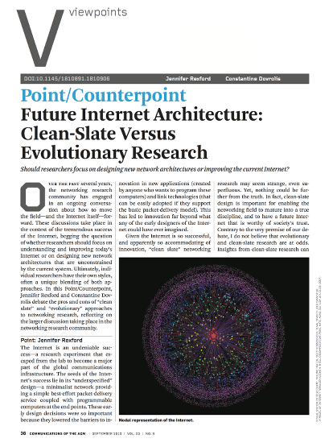

class: center, middle
# The Road to
# Software  Networks
---
class: center, top, inverse
background-image: url(images/stuck.png)

#**Internet non-programmable**
---
class: center, top, inverse
.left[

#**$$$$ in Search of**

  - ##**Programmability**

  - ##**Future Internet Architectures**
#**Clean Slate vs. Evolution**
]

---
class: center, middle, inverse
name: Clean Slate vs. Evolution Battle
.right-column.right[]
.left[#**Winner Takes All**]

.left[#**Wasteful**]

.left[#**Can't they be friends?**]
---
class: center, middle, inverse
name: Solution - Run them all together
# All Regimes Flow in Parallel

---
# Protocols are evil
.center[]
 # Stifle Development

---

# .center[High Protocol Wall]

.center[]
